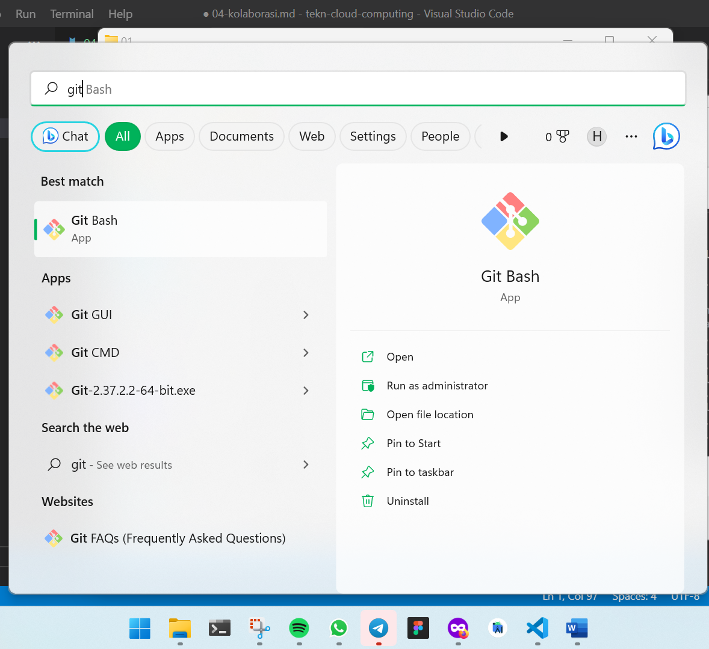
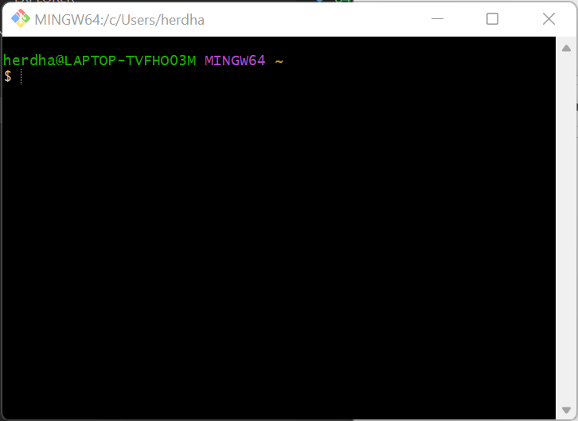
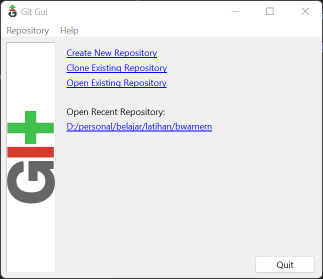

1. Karena pada komputer saya sudah terinstall git berikut adalah hasil git yang sudah terinstal.

2. Tampilan jika akan menggunakan "Git Bash"

3. Tampilan jika akan menggunakan "Git GUI"

4. Akses git dari command prompt dengan perintah git --version

