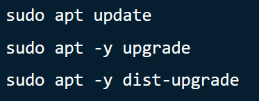
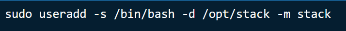
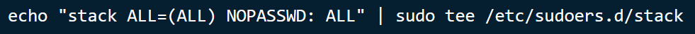
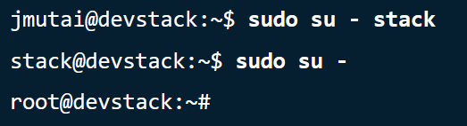
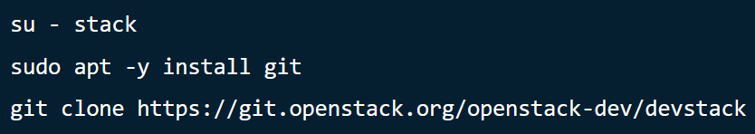
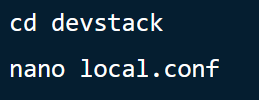
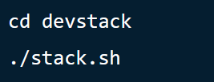
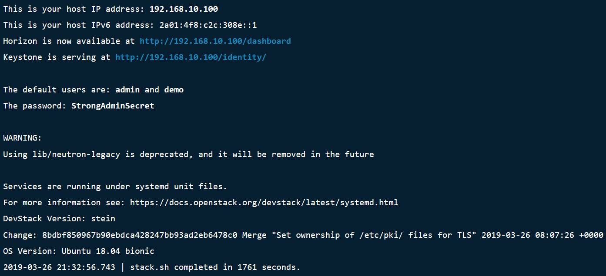
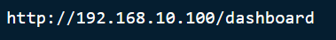
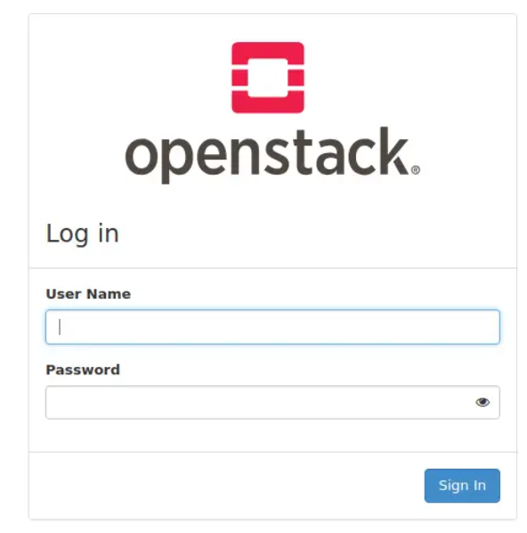

1. Update Ubuntu
    1. Login kedalam ubuntu kemudian jalankan perintah berikut 
    
    2. setelah itu lakukan Restart 
    
2. Menambahkan user baru
    1. Jalankan perintah berikut untuk membuat user    
    
    2. Beri privileges tanpa password
    
    3. Kemudian ganti user ke user yang baru saja dibuat
    
3. Download Devstack
    1. Clone devstack dari github   
    
    2. Buat konfigurasi dengan nama local.conf
    
    3. Kemudian tambahkan commands berikut
    
4. Menjalankan Openstack
    1. Jalankan perintah berikut   
    
    2. Proses install akan memakan waktu kurang lebih 15-20 menit
    
5. Mengakses dashboard Openstack 
    1. Copy URL pada browser   
    
    2. Login dengan user demo atau admin
    