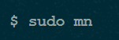

1. Menampilkan opsi startup
    1. Jalankan command berikut untuk melihat mininet startup option 
    
2. Start Wireshark
    1. Jalankan wireshark 
    
    2. Jika tidak ada wireshark lakukan clone mininet 
    
3. Interaksikan dengan Hosts dan Switches
    1. Jalankan perintah berikut 
    
    2. Menamplikan mininet CLI Command 
    
    3. Menamplikan nodes 
    
    4. Menamplikan links 
    
    5. Menamplikan informasi seluruh nodes 
    
    6. Lihat switch dan host dengan command berikut 
    
    
4. Tes Koneksi
    1. Pastikan bisa ping dari host pertama ke host kedua dengan perintah berikut 
    
    2. Cara mudahnya dengan mininet adalah sebagai berikut 
    
5. Run simple web server dan client
    1. Kemudian coba jalankan web server pada host pertama dan request dengan host kedua 
    
6. Cleanup
    1. Jika mininet mengalami kerusakan lakukan cleanup 
    