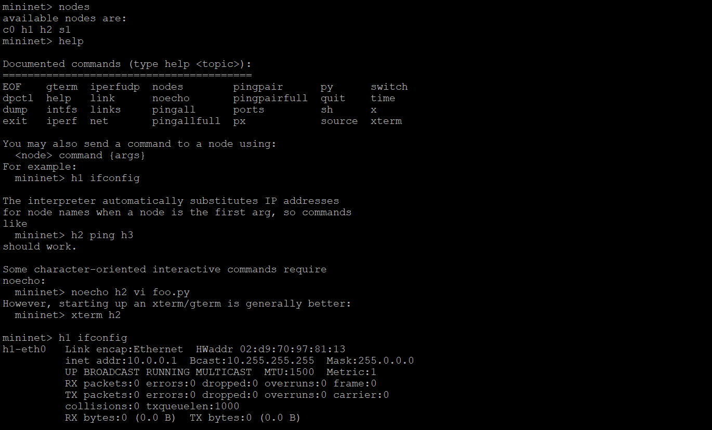

#### Setting Virtual Machine
1. Jalankan virtualbox kemudian buka file->import

2. Kemudian konfigurasi pada network adapter 2 dengan host only

3. Jalankan virtualbox image dan login menggunakan username dan password mininet

4. Kemudian lakukan konfigurasi network interface

5. Tampahkan port TCP 2222 ke port guest 22 untuk port forwarding

6. Tes dengan menjalankan putty.exe -X -P 2222 -l localhost pada command prompt komputer local

