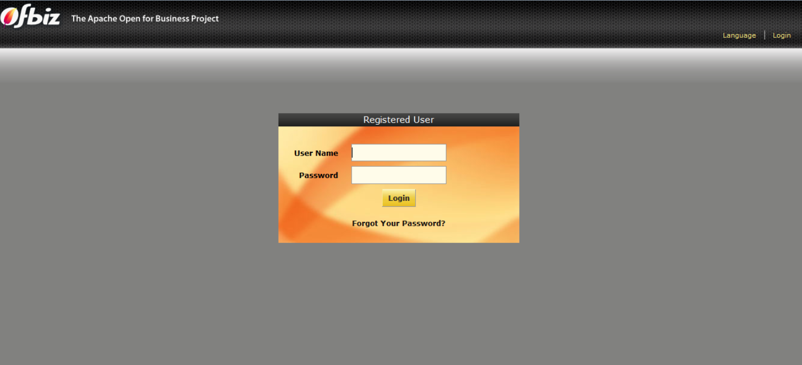

### Install Apache Ofbiz
1. Pastikan komputer sudah terinstal java
2. Donwload Apache Ofbiz dan ekstrak
3. Buka cmd dan masuk ke direktori apcahe ofbiz lalu jalankan perintah berikut untuk build
```
gradlew cleanAll loadDefault
```
4. Kemudian untuk build trunk jalankan perintah berikut:
```
gradlew cleanAll loadAll
```
5. Setelah itu menjalankan apache ofbiz dapat menggunakan perintah berikut:
```
gradlew ofbiz
```
6. Buka browser kemudian kunjungi
```
https://localhost:8443/accounting
```
lalu login dengan user admin dan password ofbiz
