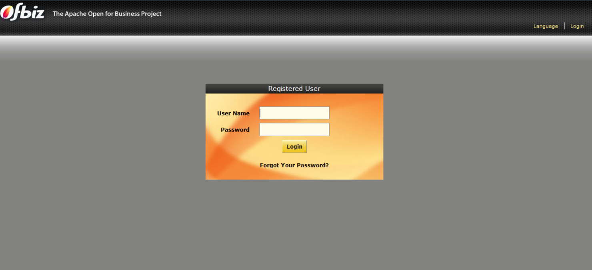

### Panduan Belanja di Webstore E-Commerce
1. Login ke dalam sistem

2. Setelah berada pada halaman utama cari produk yang diinginkan.

3. Setelah menemukan produk isi comment jika diperlukan dan juga isi jumlah kemudian klik add to cart

4. Lalu klik view cart dan centang barang yang ingin dibayar kemudian klik checkout

5. Lengkapi data yang dibutuhkan kemudian klik next

6. Isi kelengkapan bagaimana pengiriman akan dilakukan kemudian next

7. Isi metode pembayaran kemudian next

8. Periksa data sebelum benar-benar membuat pesanan. Jika sudah klik submit

9. Berikut hasil jika berhasil membuat pesanan
