### Get started with docker

#### Part 1
##### Container
```
Container is a sandboxed process on your machine that is isolated from all other processes on the host machine.
```
##### Images
```
When running a container, it uses an isolated filesystem. This custom filesystem is provided by a container image. Since the image contains the container’s filesystem, it must contain everything needed to run an application - all dependencies, configurations, scripts, binaries, etc.
```

#### Part 2
##### Get app
1. Clone source code
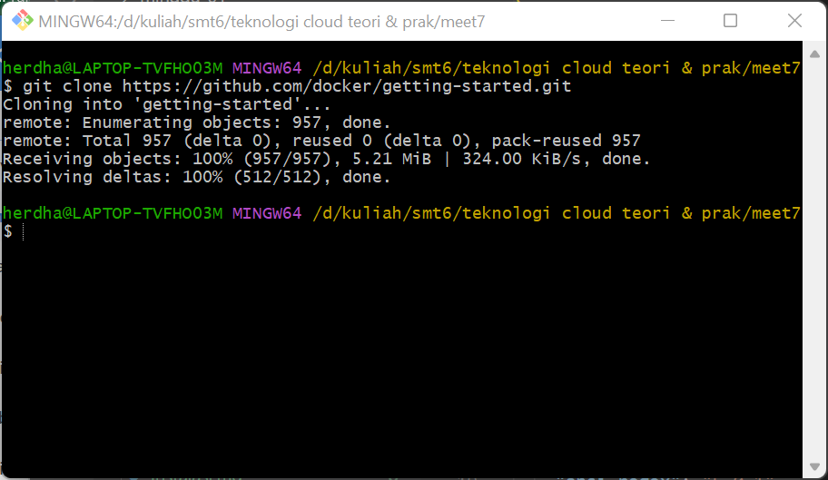

2. View the contents of the cloned repository
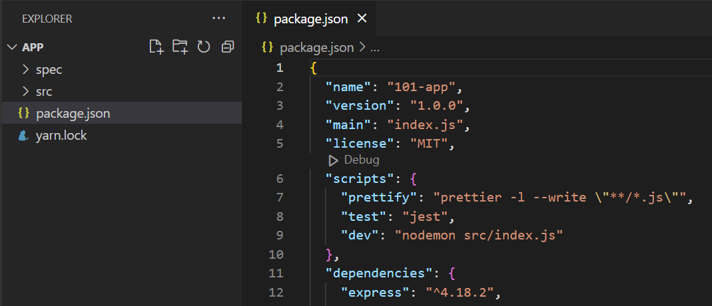

##### Build the app’s container image
1. Create docker file
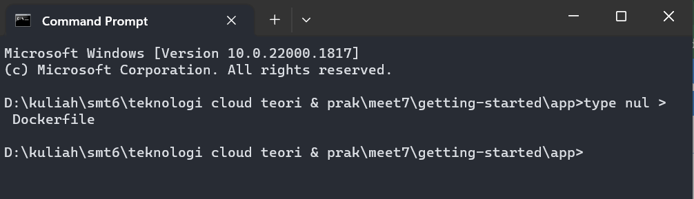

2. Add following contents to docker file
```
# syntax=docker/dockerfile:1
   
FROM node:18-alpine
WORKDIR /app
COPY . .
RUN yarn install --production
CMD ["node", "src/index.js"]
EXPOSE 3000
```

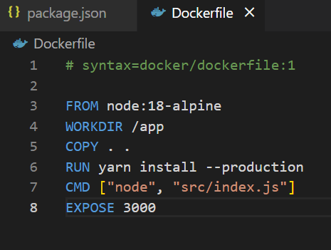

3. Build container image
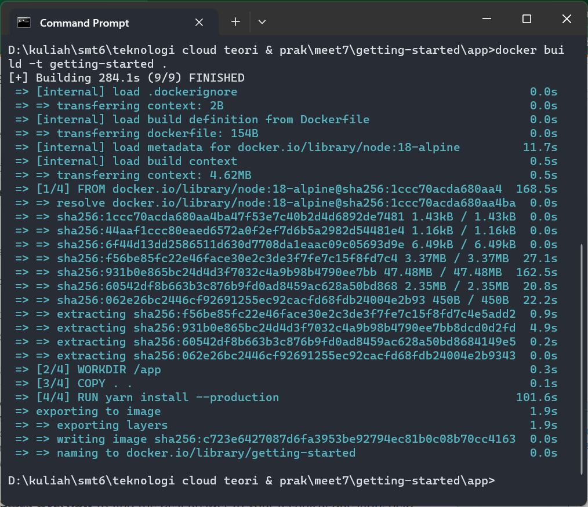

##### Start an app container
1. Start container
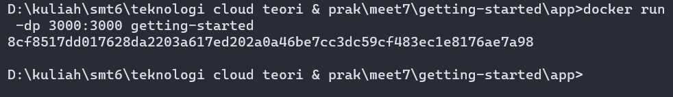

2. Open http://localhost:3000 in your browser
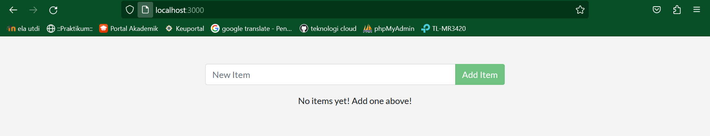

3. Try to add some items to make sure that's work properly
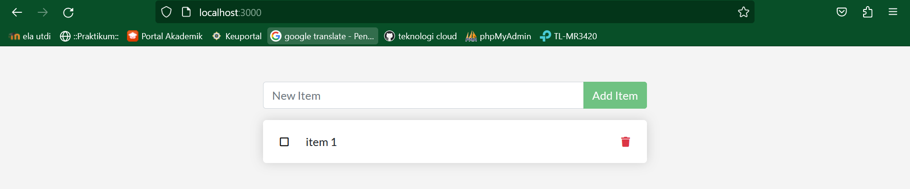

#### Part 3
##### Update source code
1. In the src/static/js/app.js file, update line 56 to use the new empty text.
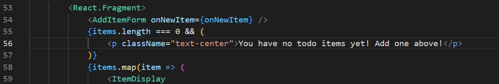

2. Build and run with these commands
```
docker build -t getting-started .
```

```
docker run -dp 3000:3000 getting-started
```
If there's an error remove the older container first

##### Remove the older container
1. Get the container id by command bellow
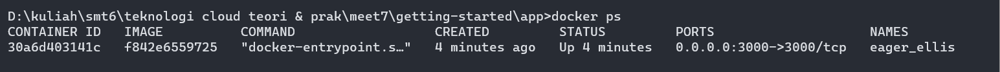

2. Stop the container
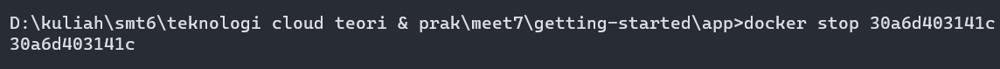

3. Remove the container
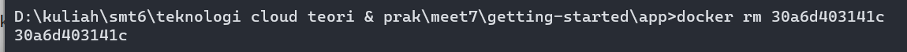

##### Start updated container
1. Start container
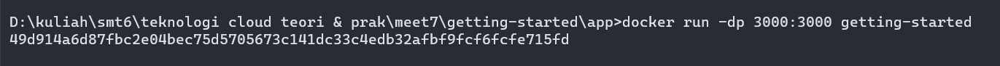

2. Check http://localhost:3000 in browser


#### Part 4
##### Create repository
1. Sign up or sign in to docker hub
2. Select the Create Repository button
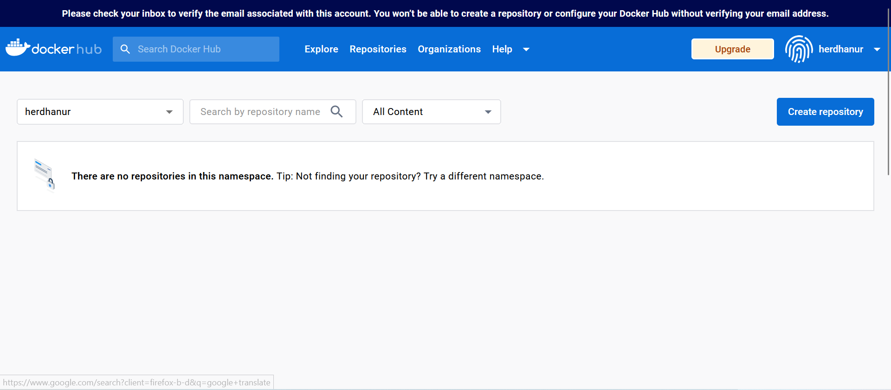

3. For the repo name, use getting-started. Make sure the Visibility is Public.
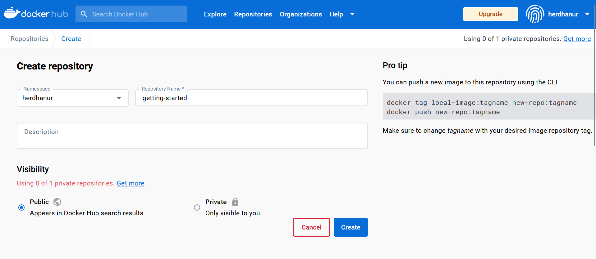

4. Select the Create button.

##### Push the image
1. In the command line, try running the push command you see on Docker Hub.
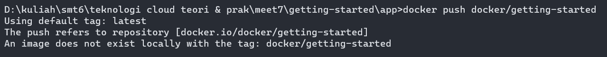

2. Docker tag getting-started YOUR-USER-NAME/getting-started
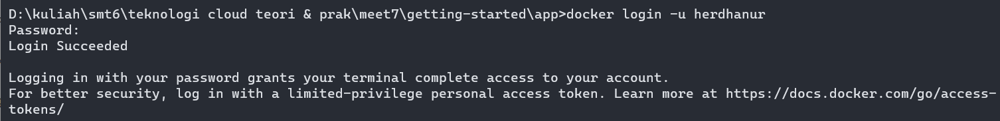

3. Use the docker tag command to give the getting-started image a new name
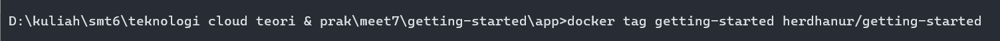

4. Now try your push command again
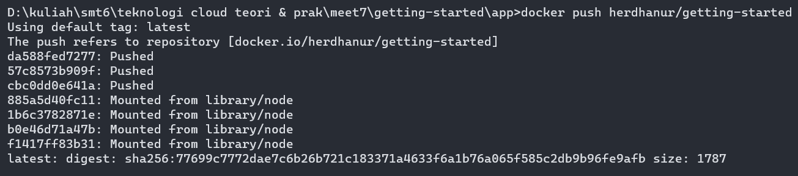

##### Run the image on a new instance
1. Open your browser to Play with Docker
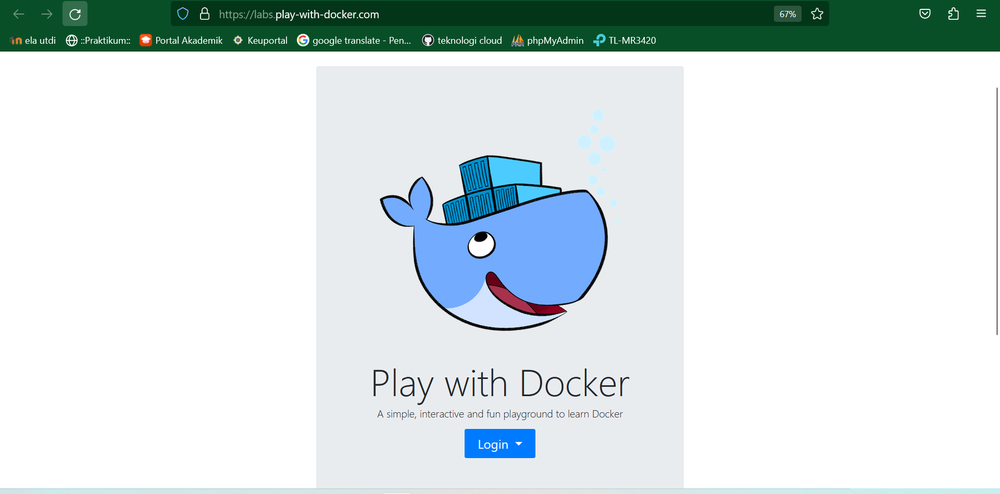

2. Select Login and then select docker from the drop-down list
3. Connect with your Docker Hub account
4. Select the ADD NEW INSTANCE option on the left side bar
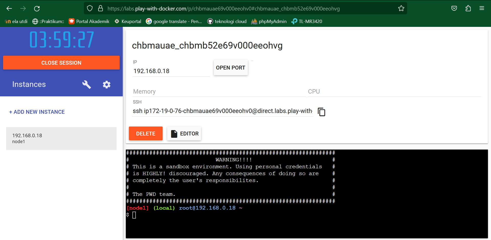

5. In the terminal, start your freshly pushed app
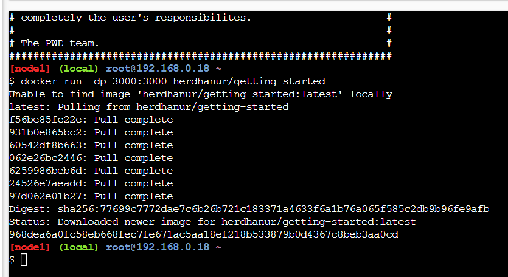

6. Select on the 3000 badge when it comes up and you should see the app with your modifications
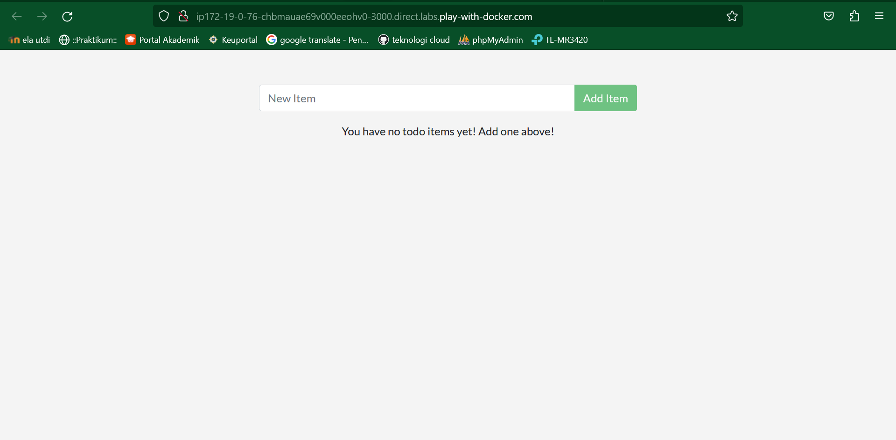

#### Part 5
##### The container’s filesystem
1. Start an ubuntu container that will create a file named /data.txt with a random number between 1 and 10000.
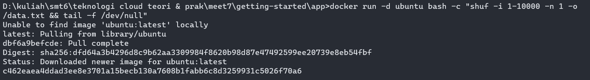

2. Validate that you can see the output by accessing the terminal in the container
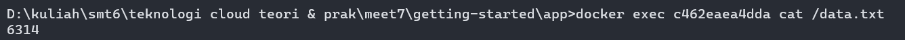

3. Start another ubuntu container (the same image) and you’ll see you don’t have the same file
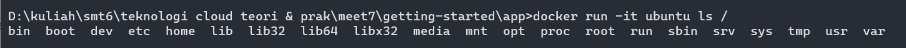

4. Go ahead and remove the first container using the docker rm -f container-id command.
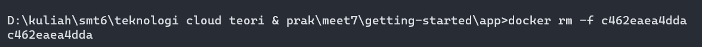

##### Persist the todo data
1. Create a volume by using the docker volume create command
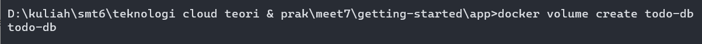
2. Stop and remove the todo app container once again in the Dashboard (or with docker rm -f id), as it is still running without using the persistent volume
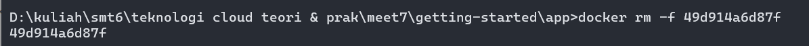
3. Start the todo app container, but add the --mount option to specify a volume mount. Give the volume a name, and mount it to /etc/todos in the container, which captures all files created at the path
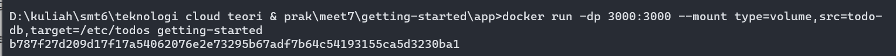
4. Once the container starts up, open the app and add a few items to your todo list
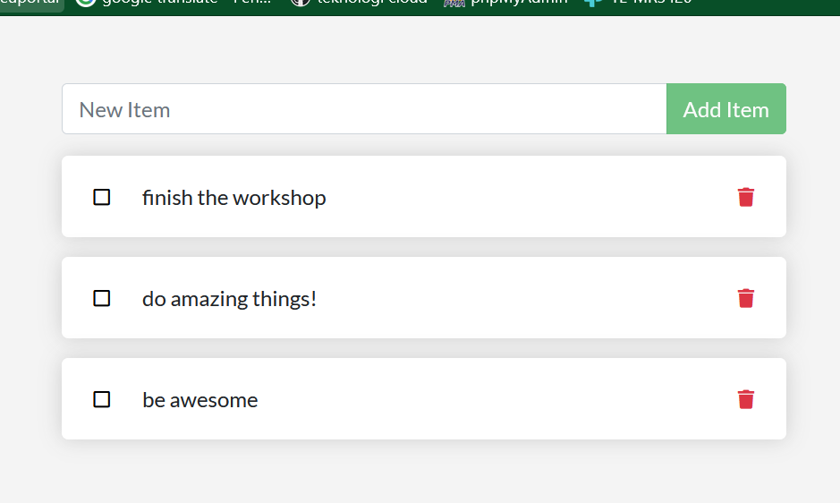
5. Stop and remove the container for the todo app. Use the Dashboard or docker ps to get the ID and then docker rm -f id to remove it

6. Start a new container using the same command from above
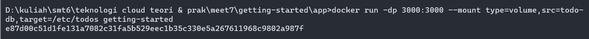
7. Open the app. You should see your items still in your list

8. Go ahead and remove the container when you’re done checking out your list


##### Dive into the volume
1. A lot of people frequently ask “Where is Docker storing my data when I use a volume?” If you want to know, you can use the docker volume inspect command
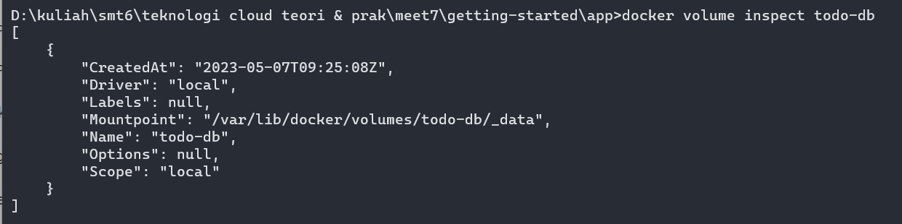
