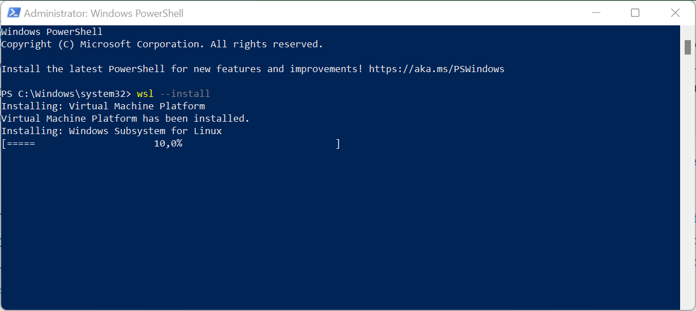
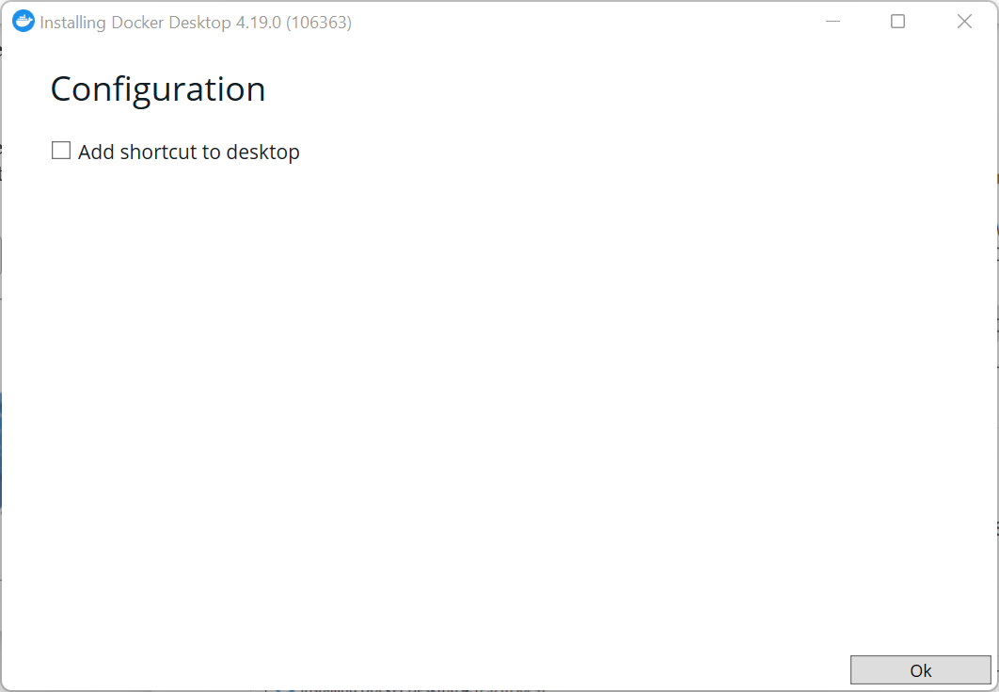
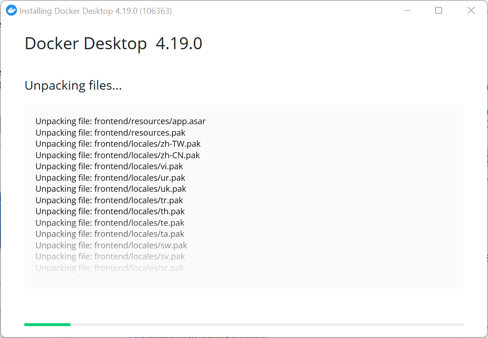
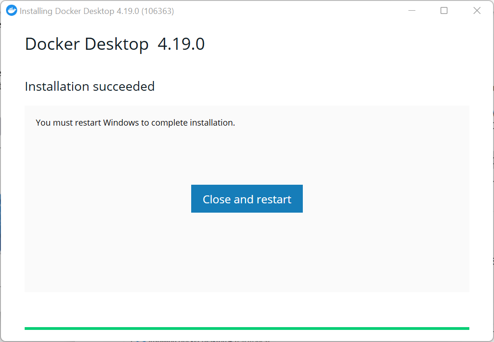
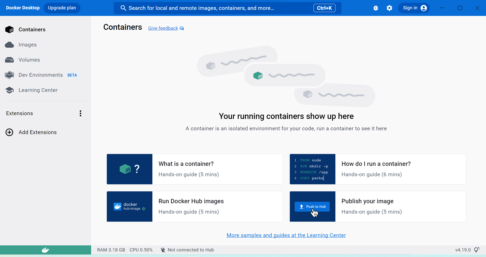

### Instalasi docker pada windows 11
1. Install wsl pada windows melalui powershell dengan perintah wsl --install

2. Download jalankan file docker desktop installer kemudian klik ok

3. Tunggu proses instal selesai

4. Kemudian klik close and restart

5. Setelah itu docker akan running secara otomatis kemudian klik accept

6. Berikut tampilan docker yang berhasil terinstal
