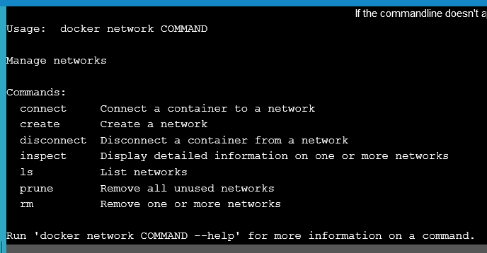
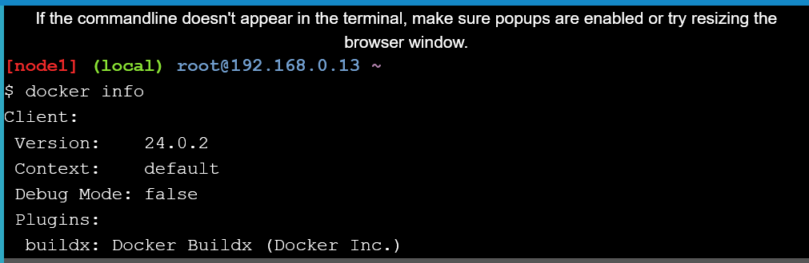
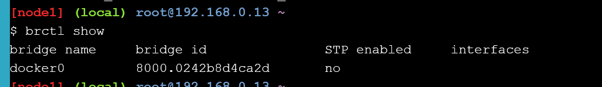
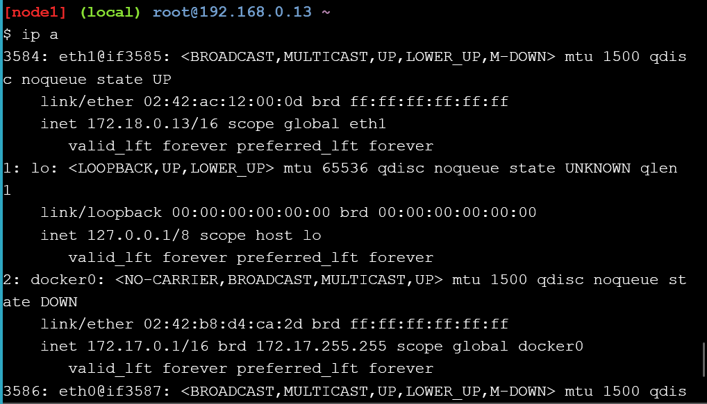
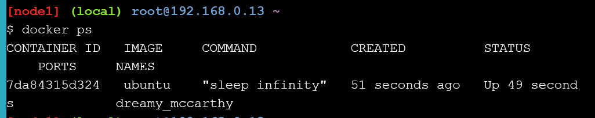
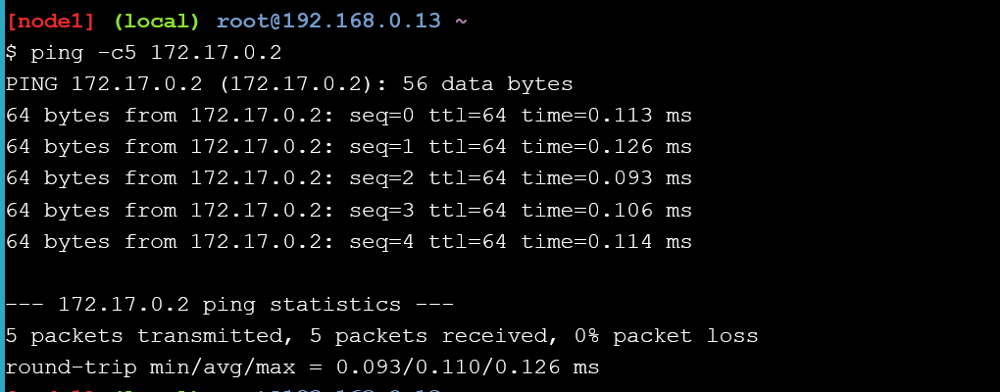
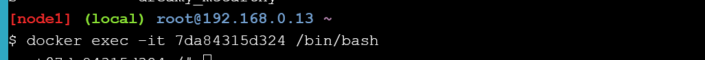
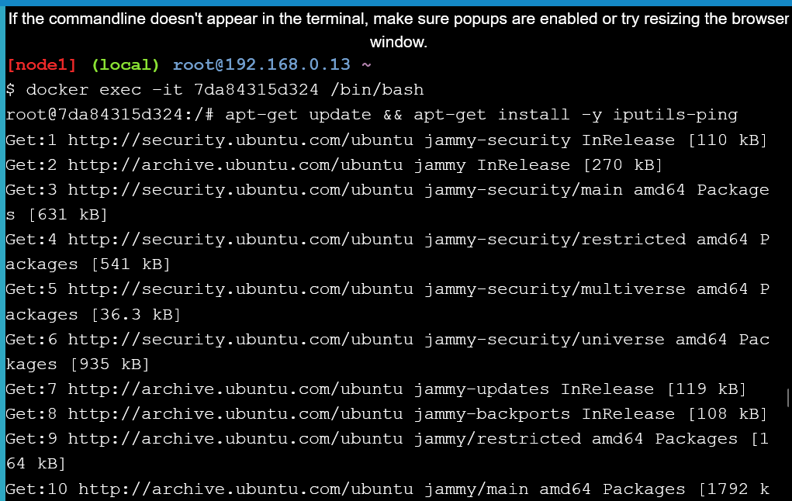
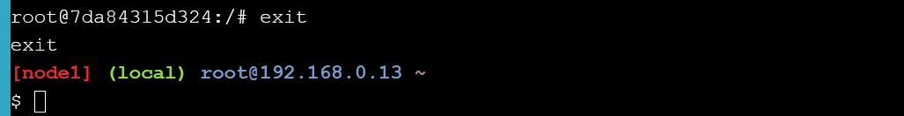
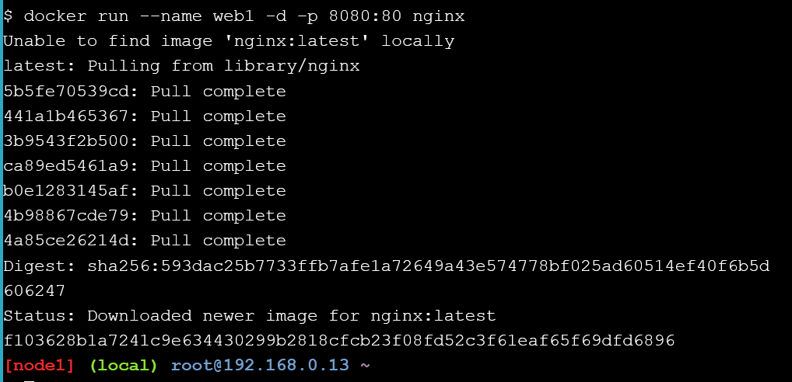

### Section #1 - Networking Basics
#### Step 1: The Docker Network Command

#### Step 2: List networks

#### Step 3: Inspect a network

#### Step 4: List network driver plugins

### Section #2 - Bridge Networking
#### Step 1: The Basics
1. Every clean installation of Docker comes with a pre-built network called bridge. Verify this with the docker network ls.

2. Install the brctl command and use it to list the Linux bridges

3. Then, list the bridges on your Docker host

4. You can also use the ip a command to view details

#### Step 2: Connect a container
1. Create a new container

2. Verify our example container is up

3. Run the brctl show

4. Inspect the bridge network

#### Step 3: Test network connectivity
1. Ping the IP address of the container from the shell prompt of your Docker host

2. Run docker ps to get ID container

3. Run a shell inside that ubuntu container, by running docker exec -it CONTAINER_ID /bin/bash.

4. Run apt-get update && apt-get install -y iputils-ping

5. Ping www.github.com

6. Disconnect our shell from the container

7. Stop this container so we clean things up from this test, by running docker stop CONTAINER_ID.

#### Step 4: Configure NAT for external connectivity
1. Start a new container based off the official NGINX image

2. Review the container status and port mappings

3. Connect from your Docker host

### Task 3: Modify a running website
#### Step 1: The Basics
#### Step 2: Create an overlay network
#### Step 3: Create a service
#### Step 4: Test the network
#### Step 5: Test service discovery

### Cleaning Up
