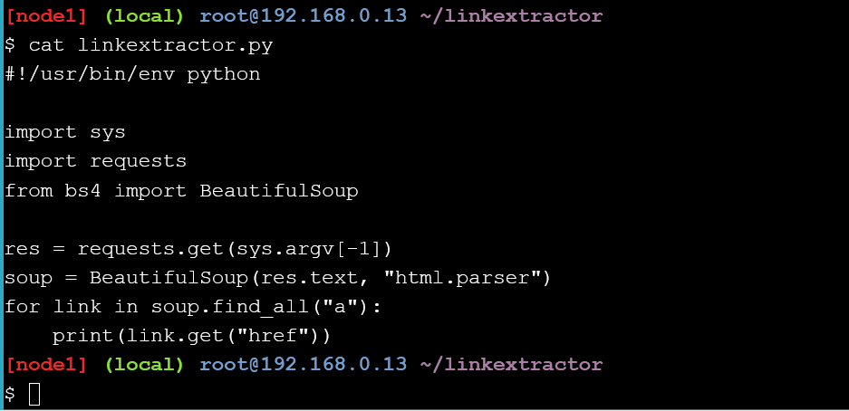
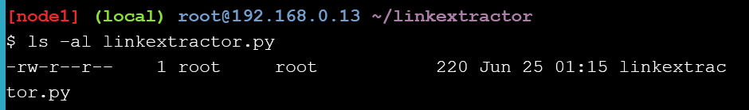
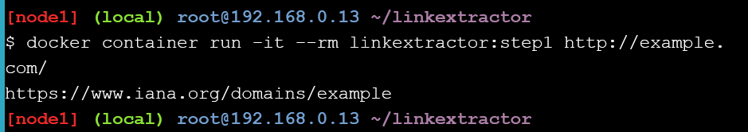
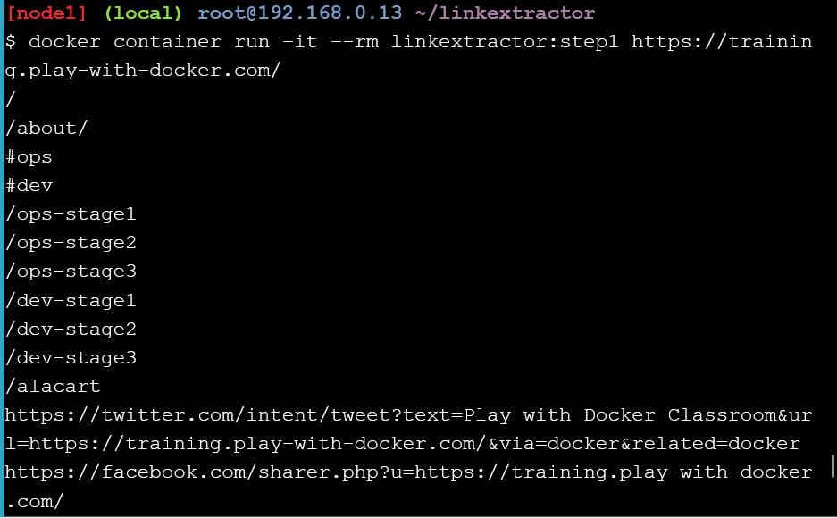

### Stage Setup
1. Let’s get started by first cloning the demo code repository, changing the working directory, and checking the demo branch out.

### Step 0: Basic Link Extractor Script
1. Checkout the step0 branch and list files in it.

2. The linkextractor.py file is the interesting one here, so let’s look at its contents:

3. However, this seemingly simple script might not be the easiest one to run on a machine that does not meet its requirements. The README.md file suggests how to run it, so let’s give it a try:

4. When we tried to execute it as a script, we got the Permission denied error. Let’s check the current permissions on this file:

5. We can either change it by running chmod a+x linkextractor.py or run it as a Python program instead of a self-executing script as illustrated below:

### Step 1: Containerized Link Extractor Script
1. Checkout the step1 branch and list files in it.

2. We have added one new file (i.e., Dockerfile) in this step. Let’s look into its contents:

3. So far, we have just described how we want our Docker image to be like, but didn’t really build one. So let’s do just that:

4. We have created a Docker image named linkextractor:step1 based on the Dockerfile illustrated above. If the build was successful, we should be able to see it in the list of image:

5. Now, let’s run a one-off container with this image and extract links from some live web pages:

6. Let’s try it on a web page with more links in it:

### Step 2: Link Extractor Module with Full URI and Anchor Text
1. Checkout the step2 branch and list files in it.

2. Let’s have a look at the updated script:

3. Now, let’s build a new image and see these changes in effect:

4. We have used a new tag linkextractor:step2 for this image so that we don’t overwrite the image from the step1 to illustrate that they can co-exist and containers can be run using either of these images.

5. Running a one-off container using the linkextractor:step2 image should now yield an improved output:

6. Running a container using the previous image linkextractor:step1 should still result in the old output:

### Step 3: Link Extractor API Service
1. Checkout the step3 branch and list files in it.

2. Let’s first look at the Dockerfile for changes:

3. The linkextractor.py module remains unchanged in this step, so let’s look into the newly added main.py file:

4. It’s time to build a new image with these changes in place:

5. We are also assigning a name (--name=linkextractor) to the container to make it easier to see logs and kill or remove the container.

6. If things go well, we should be able to see the container being listed in Up condition:

7. We can now make an HTTP request in the form /api/<url> to talk to this server and fetch the response containing extracted links:

8. Since the container is running in detached mode, so we can’t see what’s happening inside, but we can see logs using the name linkextractor we assigned to our container:

9. We can see the messages logged when the server came up, and an entry of the request log when we ran the curl command. Now we can kill and remove this container:

### Step 4: Link Extractor API and Web Front End Services
### Step 5: Redis Service for Caching
### Step 6: Swap Python API Service with Ruby