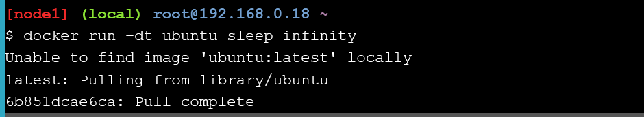
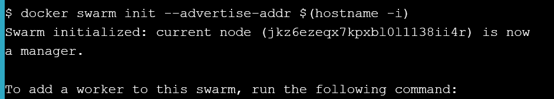

### Section #1 - What is Orchestration
So, what is Orchestration anyways? Well, Orchestration is probably best described using an example. Let’s say that you have an application that has high traffic along with high-availability requirements. Due to these requirements, you typically want to deploy across at least 3+ machines, so that in the event a host fails, your application will still be accessible from at least two others. Obviously, this is just an example and your use-case will likely have its own requirements, but you get the idea.

### Section #2 - Configure Swarm Mode
1. Running things manually and on a single host would be to create a new container on node1 by running docker run -dt ubuntu sleep infinity

2. You can verify our example container is up by running docker ps on node1.

#### Step 2.1 - Create a Manager node
1. Run docker swarm init on node1.

2. Run the docker info command to verify that node1 was successfully configured as a swarm manager node.

#### Step 2.2 - Join Worker nodes to the Swarm
1. Copy and paste command from output docker swarm node1 to terminal of node2 and node3.

2. Switch back to node1, and run a docker node ls to verify that both nodes are part of the Swarm

### Section #3 - Deploy applications across multiple hosts
#### Step 3.1 - Deploy the application components as Docker services
1. Let’s deploy sleep as a Service across our Docker Swarm.

2. Verify that the service create has been received by the Swarm manager.

### Section #4 - Scale the application
### Section #5 - Drain a node and reschedule the containers
### Cleaning Up