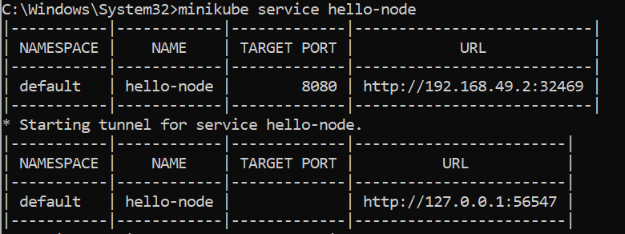

### Preparation
1. Make sure your pc has installed with minikube and kubectl

### Create a minikube cluster
1. Run this command bellow  

### Open the Dashboard
1. Open new terminal and run  

### Create a Deployment
1. Use the kubectl create command to create a Deployment that manages a Pod. The Pod runs a Container based on the provided Docker image.  

2. View the Deployment:  

3. View the Pod:  

4. View cluster events: 

5. View the kubectl configuration: 

### Create a Service
1. Expose the Pod to the public internet using the kubectl expose command:  

2. View the Service you created:  

3. Run the following command:  

### Enable addons
### Clean up