### Preparation
1. Make sure your pc has installed with minikube and kubectl

### Create a minikube cluster
1. Run this command bellow  
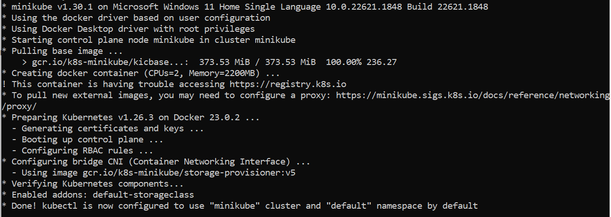

### Open the Dashboard
1. Open new terminal and run  
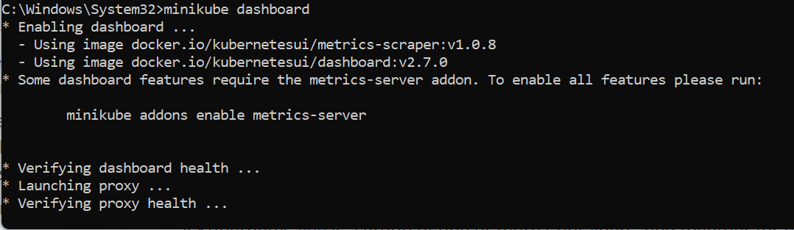

### Create a Deployment
1. Use the kubectl create command to create a Deployment that manages a Pod. The Pod runs a Container based on the provided Docker image.  
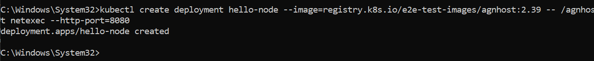
2. View the Deployment:  
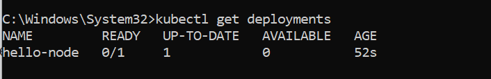
3. View the Pod:  
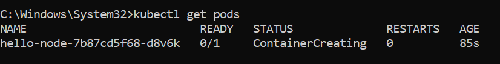
4. View cluster events: 
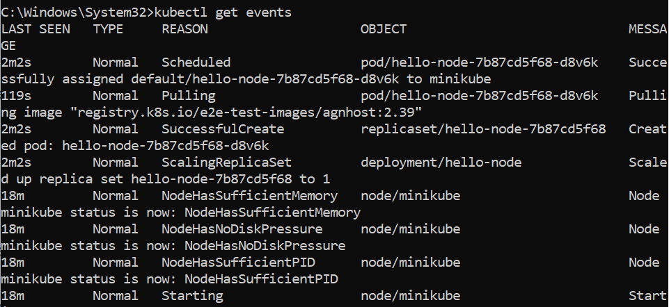
5. View the kubectl configuration: 
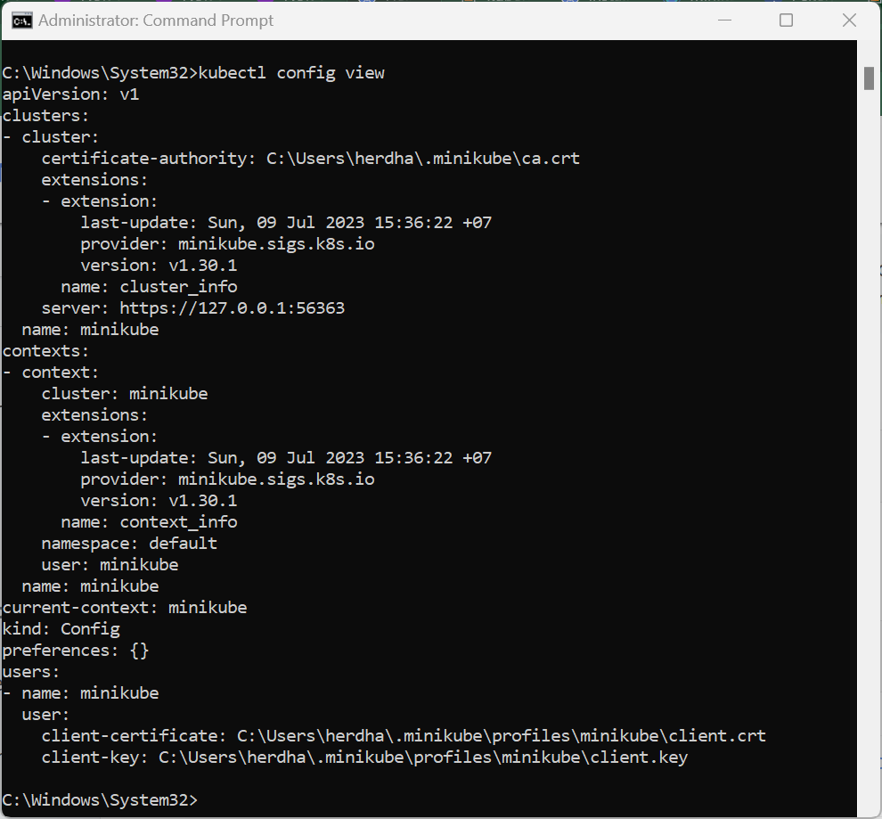

### Create a Service
1. Expose the Pod to the public internet using the kubectl expose command:  

2. View the Service you created:  
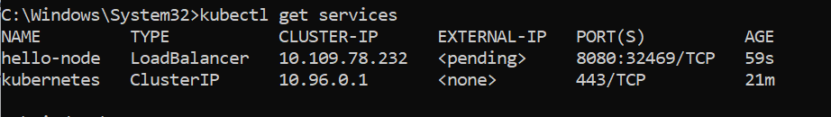
3. Run the following command:  
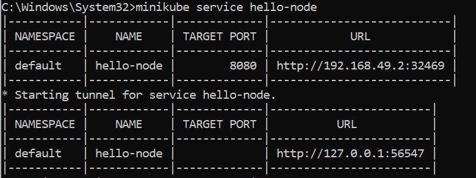

### Enable addons
1. List the currently supported addons:  

2. View the Pod and Service you created by installing that addon:  
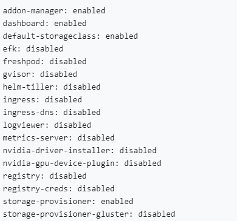

### Clean up
1. Now you can clean up the resources you created in your cluster:  
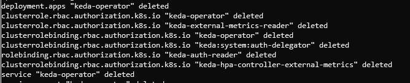
2. Stop the Minikube cluster:  
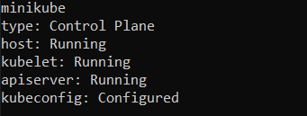